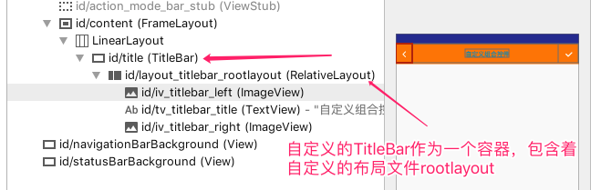

TitleBar类中this的理解


```java
    private void initView(Context context) {
//   seachal annotation，此时的第二个参数this的理解，是当前TitleBar，TitleBar包含了view_customtitle。
     LayoutInflater.from(context).inflate(R.layout.view_customtitle, this, true);
```




